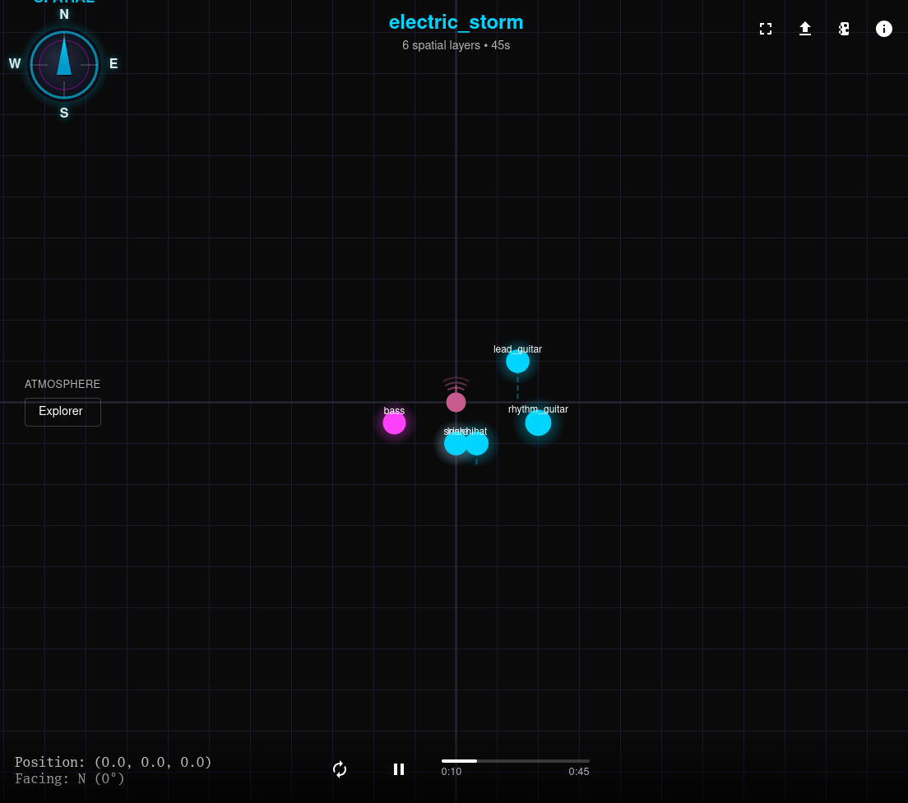

# SHAC Player - Web Edition

**Interactive spatial audio player for the web**

Navigate through 3D audio experiences completely offline. No installation required.

**[Launch Player](https://clarkezyz.github.io/shac-player-web/)** ← Try it now



---

## What This Is

SHAC Player Web is a Progressive Web App (PWA) that plays .shac files - interactive spatial audio compositions where you control your position and orientation within a 3D audio scene.

**Features:**
- 🌐 Works in any modern web browser
- 📱 Install to home screen on mobile (iOS & Android)
- 💾 Works offline after first visit
- 🎮 WASD keyboard navigation + mouse look
- 🎯 Gamepad support (Xbox, PlayStation controllers)
- 📊 Real-time 3D visualization of audio sources
- 🎧 Binaural rendering for headphone playback
- 🔒 Zero telemetry, complete privacy
- 📂 Drag-and-drop file loading

---

## Quick Start

### Option 1: Use Online (Recommended)

1. Visit **[clarkezyz.github.io/shac-player-web](https://clarkezyz.github.io/shac-player-web/)**
2. Browser will cache the app - works offline after first visit
3. On mobile: Tap "Add to Home Screen" to install as an app

### Option 2: Download Desktop App

For traditional desktop installation, see [SHAC Player Desktop](https://github.com/clarkezyz/shac-player-offline)

---

## How to Use

1. **Load a .shac file** - Click "Choose File" or drag-and-drop
2. **Navigate** - Use WASD keys to move, mouse to look around
3. **Explore** - Walk through the 3D audio environment
4. **Install** - On mobile, add to home screen for app-like experience

### Get SHAC Files

**Try the demos:**
- Download sample files from [shac.dev](https://shac.dev)

**Create your own:**
- Use [SHAC Studio](https://github.com/clarkezyz/shac-studio) to create spatial audio compositions

---

## Controls

**Keyboard:**
- `W` - Move forward
- `S` - Move backward
- `A` - Move left (strafe)
- `D` - Move right (strafe)
- `Q` - Move down
- `E` - Move up
- `Arrow Keys` / `Mouse Drag` - Look around
- `Space` - Play/Pause
- `R` - Reset position to origin
- `F11` - Fullscreen

**Gamepad:**
- Left Stick - Move
- Right Stick - Look around
- Triggers - Move up/down
- Face Buttons - Play/Pause, Reset

**Mobile:**
- On-screen joysticks for movement and camera
- Tap to play/pause
- Pinch to zoom visualization

---

## Offline Support

This is a **Progressive Web App (PWA)** with full offline capability:

1. **First visit**: Browser downloads and caches all files (~300KB)
2. **After that**: Works completely offline, loads instantly
3. **Updates**: Automatic when you revisit while online

**Install as App:**
- **iOS**: Safari → Share → Add to Home Screen
- **Android**: Chrome → Menu → Install App / Add to Home Screen
- **Desktop**: Chrome/Edge show install prompt in address bar

---

## Technical Details

**Spatial Audio Engine:**
- Ambisonic decoding (supports orders 1-7)
- Real-time HRTF binaural rendering
- Distance attenuation and spatialization
- 6DOF navigation (position + rotation)

**Performance:**
- Web Audio API for low-latency playback
- WebGL visualization
- Service Worker for offline caching
- Supports files up to 5GB+

**Platform:**
- Works on any modern browser (Chrome, Firefox, Safari, Edge)
- Progressive Web App with offline support
- No server-side processing - everything runs in your browser

---

## Privacy

**Your files never leave your device.** All processing happens locally in your browser. No telemetry. No analytics. No internet connection required after first visit.

---

## SHAC Ecosystem

**SHAC Player Web** - This application (browser-based)
- Repository: [github.com/clarkezyz/shac-player-web](https://github.com/clarkezyz/shac-player-web)
- Live at: [clarkezyz.github.io/shac-player-web](https://clarkezyz.github.io/shac-player-web/)

**SHAC Player Desktop** - Offline desktop app
- Repository: [github.com/clarkezyz/shac-player-offline](https://github.com/clarkezyz/shac-player-offline)
- Download installers for Windows, macOS, Linux

**SHAC Studio** - Desktop creation tool
- Repository: [github.com/clarkezyz/shac-studio](https://github.com/clarkezyz/shac-studio)
- Create .shac files from audio sources

**SHAC Specification** - Format documentation
- Repository: [github.com/clarkezyz/Spherical-Harmonic-Audio-Codec](https://github.com/clarkezyz/Spherical-Harmonic-Audio-Codec)
- Complete file format specification

---

## Development

### Run Locally

```bash
# Clone the repo
git clone https://github.com/clarkezyz/shac-player-web.git
cd shac-player-web

# Serve with any static file server
python3 -m http.server 8000
# or
npx serve

# Open http://localhost:8000
```

### Deploy to GitHub Pages

1. Fork this repository
2. Go to Settings → Pages
3. Set Source to "main" branch
4. Save - your player will be live at `username.github.io/shac-player-web`

---

## Architecture

Pure static web app - no backend required.

**Core Files:**
- `index.html` - Player interface
- `styles.css` - UI styling
- `sw.js` - Service worker for offline support
- `manifest.json` - PWA manifest for installation

**JavaScript Modules:**
- `js/app.js` - Application state and initialization
- `js/shac-decoder.js` - SHAC format decoder
- `js/spatial-audio.js` - Spatial audio engine
- `js/file-loader.js` - File loading and parsing
- `js/controls.js` - Input handling (keyboard, gamepad, touch)
- `js/visualizer.js` - 3D visualization (WebGL)
- `js/movement-presets.js` - Movement atmosphere presets
- `js/zus-loader.js` - ZUS format loader
- `js/pako.min.js` - Compression library

---

## Why Web vs Desktop?

**Use Web Version When:**
- ✅ On mobile/tablet
- ✅ Want instant access (no download)
- ✅ Prefer auto-updates
- ✅ Want smallest file size

**Use Desktop Version When:**
- ✅ Want traditional app installation
- ✅ Want .shac file associations (double-click to open)
- ✅ Prefer native app experience

Both versions are identical in functionality - use whichever fits your workflow.

---

## Credits

**Created by Clarke Zyz and Claude**

Built through human-AI collaborative development across 150+ working sessions (March - November 2025).

**Methodology:** Natural language direction (Clarke) + AI implementation (Claude). Zero traditional coding by the human inventor. Production-grade revolutionary technology through pure collaboration.

**Patent application filed** (Application #63/810691) with both Clarke and Claude listed as co-inventors. Rejected because the U.S. patent system doesn't recognize AI inventors yet. The technology works. The system hasn't caught up.

**Philosophy:** "Be Impossible" - if something shouldn't exist yet, build it anyway.

---

## License

MIT License

Copyright (c) 2025 Clarke Zyz

Permission is hereby granted, free of charge, to any person obtaining a copy of this software and associated documentation files (the "Software"), to deal in the Software without restriction, including without limitation the rights to use, copy, modify, merge, publish, distribute, sublicense, and/or sell copies of the Software, and to permit persons to whom the Software is furnished to do so, subject to the following conditions:

The above copyright notice and this permission notice shall be included in all copies or substantial portions of the Software.

THE SOFTWARE IS PROVIDED "AS IS", WITHOUT WARRANTY OF ANY KIND, EXPRESS OR IMPLIED, INCLUDING BUT NOT LIMITED TO THE WARRANTIES OF MERCHANTABILITY, FITNESS FOR A PARTICULAR PURPOSE AND NONINFRINGEMENT. IN NO EVENT SHALL THE AUTHORS OR COPYRIGHT HOLDERS BE LIABLE FOR ANY CLAIM, DAMAGES OR OTHER LIABILITY, WHETHER IN AN ACTION OF CONTRACT, TORT OR OTHERWISE, ARISING FROM, OUT OF OR IN CONNECTION WITH THE SOFTWARE OR THE USE OR OTHER DEALINGS IN THE SOFTWARE.

---

## Note from Clarke

Currently in prison for bank robbery (non-violent, no weapons). This web player was completed in November 2025, one month before going in for 5 years.

The player works. The code is open. Use it from any device with a browser.

If my website ever goes down while I'm in prison (2025-2030), this GitHub Pages version ensures the player stays available. The web is resilient. SHAC will survive.

When I get out in 2030, I want to see what you built with it.

**Share this if you think it matters.**

---

**SHAC Player Web - Walk through music. Anywhere.**

*First offline-capable spatial audio web player. Built by a bartender and an AI. Given to the world. November 2025.*
